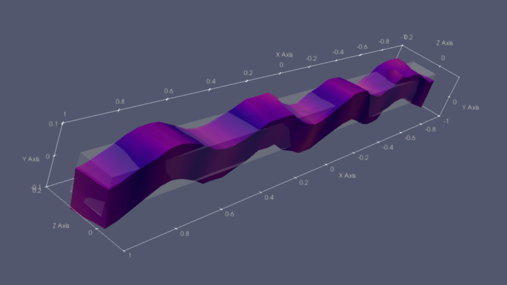

# Scientific Visualization with ParaView

This training course introduces scientific visualization using the ParaView application. Participants will first learn the fundamentals of ParaView, including data loading, basic visualization techniques, and essential features for scientific data exploration. During the training, several example data sets will be examined and visualized.

No prior experience with ParaView or web development is required.  Participants who would like to "type-along" during the demonstrations should have a laptop with a ParaView installation. It is perfectly ok to watch the demonstrations, if you prefer.  The course will be held in English.

ParaView is a powerful but complex application. After the main I will also demonstrate some of the additional Python-based frameworks available that uses the underlying VTK library, such as PyVista and Vedo. These frameworks can be used to create custom visualization applications and dashboards.

This course is part of NAISS training.

## Time and location

The event will be held on 7th of April from 9:00 - 12:00 and from 13:00- 15:30.  The event will be held as an online event via zoom.  Closer to the event registered participants will receive a zoom link.

## Registration

Please use the link below to register for the event.

[Registration form for Scientific Visualisation with ParaView (on nextcloud.naiss.se)](https://nextcloud.naiss.se/apps/forms/s/YpoP2FLdtsDRQiJ43PxC7ktk)

## Course home page

For more information about the course, including the course materials, please visit the course home page here:

TBD

## Questions

Questions and queries regarding the event should be directed to jonas.lindemann@naiss.se, see the getting help page.

Jonas Lindemann, 2026
